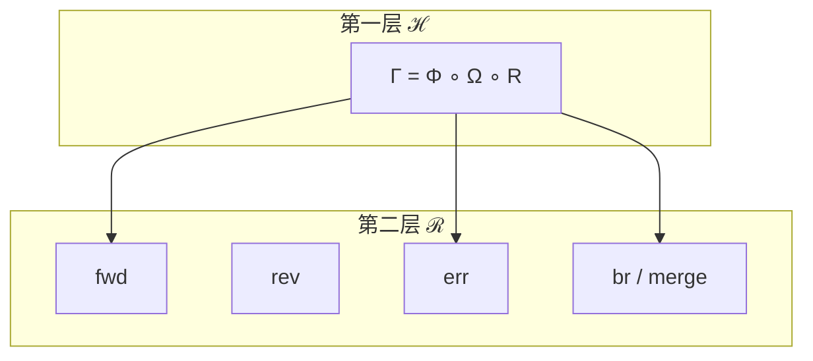

# Evo Agent System 的数学表达验证

> 公式见 [state-model.html](./state-model.html)（浏览器打开才会排版）。

主题是 **evo agent system**：冻结模型，进化的是 agent harness。数学对象直接借 Survey 的六元组，再补上我们的一代算子。

Survey **Definition 2.1**：

\[
H=(E,T,C,S,L,V)\in\mathcal{H}
\]

| 符号 | 名字 | 管什么 | 不管什么 |
| --- | --- | --- | --- |
| \(E\) | Agent Loop | 看环境 → 想 → 动手的循环，停与纠错（LTS） | 工具清单；也不负责改 harness |
| \(T\) | Tool registry | 可调用的效应器、路由、schema | 循环怎么转；窗口里塞什么 |
| \(C\) | Context manager | 这一拍进模型窗口的内容（压缩 / 检索） | 跨会话持久化（那是 \(S\)） |
| \(S\) | State store | harness **内部**抽屉：跨 turn / 崩溃恢复 | git 里那份整体 \(H\) |
| \(L\) | Lifecycle hooks | 调用前后拦截：鉴权、日志、策略 | 对外可评测的轨迹口（那是 \(V\)） |
| \(V\) | Evaluation interface | 轨迹 / 成功信号的出口 | 打分、合入 git；外层 \(\Omega\) 读它吐出的流 |

git 里每个 commit 带一份 \(H\)。历史是 **DAG**，不是一条直线。模型在 \(H\) 之外。

---

## Base · \(H\) 的定义

Survey **Definition 2.1**：

\[
H=(E,T,C,S,L,V)\in\mathcal{H}
\]

必要：\(\{E,T\}\subseteq H\)。充分：六件齐备。

\(E\) 的语义是 LTS：

\[
E=(Q,\Sigma,\delta),\qquad \delta:Q\times\Sigma\to Q
\]

git 载荷是整份 \(H\)，不是内部的 \(S\)：

\[
\mathrm{commit}\ \Leftrightarrow\ H,\qquad S\neq\mathcal{H},\qquad M\notin H
\]

\(\Gamma\) 改 \(H\) 不改模型。

---

## 第一层 · 转换算子

\(\Gamma\) 活在 harness 空间上，**不算 git 历史**。展开成三步再合成：

\[
\tau = R(H),\qquad R:\mathcal{H}\to\mathcal{T}
\]

\[
o=\Omega(\tau)=\Omega(R(H)),\qquad \Omega:\mathcal{T}\to\mathcal{O}
\]

\[
H^{+}=\Phi(H,o),\qquad \Phi:\mathcal{H}\times\mathcal{O}\to\mathcal{H}
\]

\[
\Gamma:\mathcal{H}\to\mathcal{H},\qquad
\Gamma(H)\;\triangleq\; \Phi\!\bigl(H,\,\Omega(R(H))\bigr)
=\Phi\circ(\mathrm{id},\Omega\circ R)
\]

\(R\) 展开 Agent Loop（判题或 sandbox），不写 commit。\(\Omega\) 消费 \(V\) 吐出的途中与结果。\(\Phi\) 算出下一份 \(H\)，不跑用户任务。

验证：\(\Gamma\) 的定义域/值域都是 \(\mathcal{H}\)，式中不出现 ref、parent、merge。A→B 要用第二层的 \(\mathrm{fwd}\) 才能把 \(\Gamma(H_A)\) 钉到 DAG 上。

---

## 第二层 · git DAG

仓库 \(\mathcal{R}\) 是带 ref 的 commit DAG。每个 commit \(c\) 有载荷 \(H(c)\) 和双亲 \(\pi(c)\)。

**正向**（以前的 A→B 只是这个）：

\[
\mathrm{fwd}(A)=B,\qquad H_B=\Gamma(H_A),\qquad \pi(B)=\{A\}
\]

HEAD 从 \(A\) 挪到 \(B\)，不删除 \(A\)。反复 \(\mathrm{fwd}\) 才是线性的 \(H_{n+1}=\Gamma(H_n)\)。

**revert**：像 git revert，在当前之上新建 commit，内容回到祖先 \(H_{A^-}\)，不改写历史。

\[
\mathrm{rev}(A,A^{-})=A',\qquad H_{A'}=H_{A^{-}},\qquad \pi(A')=\{A\}
\]

**error commit**：Runtime 或 \(\Phi\) 失败仍落盘，并打 \(\mathrm{ok}=\bot\)。下一轮 \(\Gamma\) 看得到 \(o_\bot\)。

\[
\mathrm{err}(A,o_\bot)=A_\bot
\]

**branch / merge**：

\[
\mathrm{br}(\ell,A),\qquad
\mathrm{merge}(B_1,\ldots,B_k)=M,\qquad
H_M=\mu(H_{B_1},\ldots,H_{B_k}),\qquad
\pi(M)=\{B_1,\ldots,B_k\}
\]

\(\mu\) 可以调用 \(\Phi\)（带着多路观测）。谁和谁合、合完指向哪，是第二层的事；第一层仍然只转换 \(H\)。

